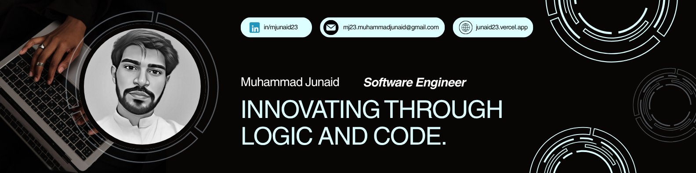

<!-- 

  

 -->

<!-- Uncomment and add your banner image when ready -->

  

<h1 align="center">
    
</h1>

## 🌐 Connect with Me

  
  
  
  

---

## 🚀 About Me

- 🎓 **Computer Science Student** at Virtual University of Pakistan
- 💼 Currently working as **Frontend Developer** at **Trust Nexus**
- 🌱 Building scalable web applications with **React.js**, **Next.js**, and **TypeScript**
- 🤖 Passionate about **AI/ML** and exploring **Web3** technologies
- 🎯 Focused on creating performant, user-centric applications

## 🎨 Featured Projects

### 🌟 Imaginera – [Live Demo](https://imaginera.vercel.app)

**Full-Stack SaaS Platform with AI Image Processing**

Built a production-ready SaaS platform featuring advanced AI capabilities including image restoration, object removal, background removal, recoloring, and generative fill. Implemented comprehensive features including Stripe payment integration, Clerk authentication, community gallery, and advanced search functionality.

**Tech Stack:** Next.js, MongoDB, Cloudinary, Tailwind CSS, Stripe, Clerk

<!-- Add project screenshot when ready -->
<!-- 

  

 -->

---

### 🤖 Researcher AI – [GitHub Repo](https://github.com/Muhammad-Junaid23/Researcher-AI)

**Autonomous AI Research Agent**

Developed an autonomous AI agent using LangChain and LangGraph to automate the entire academic research workflow. The system searches arXiv.org, synthesizes findings, and generates structured, citation-ready papers in LaTeX and PDF formats powered by Google's Gemini models.

**Tech Stack:** Python, LangChain, LangGraph, Google Gemini API, LaTeX

<!-- Add project screenshot when ready -->
<!-- 

  

 -->

---

<h1 align="left">
   Tech Stack & Tools
</h1>

<table style="border-collapse: collapse; width: 100%; max-width: 900px; margin: 20px auto; font-family: Arial, sans-serif;">
  <tr>
    <!-- Frontend Technologies -->
    <td align="center" style="padding: 12px;">
       JavaScript
    </td>
    <td align="center" style="padding: 12px;">
       TypeScript
    </td>
    <td align="center" style="padding: 12px;">
       React.js
    </td>
    <td align="center" style="padding: 12px;">
       Next.js
    </td>
    <td align="center" style="padding: 12px;">
       TailwindCSS
    </td>
    <td align="center" style="padding: 12px;">
       HTML5
    </td>
    <td align="center" style="padding: 12px;">
       CSS3
    </td>
  </tr>

  <tr>
    <!-- Backend & Database -->
    <td align="center" style="padding: 12px;">
       Node.js
    </td>
    <td align="center" style="padding: 12px;">
       Express.js
    </td>
    <td align="center" style="padding: 12px;">
       MongoDB
    </td>
    <td align="center" style="padding: 12px;">
       Prisma
    </td>
    <td align="center" style="padding: 12px;">
       Python
    </td>
    <td align="center" style="padding: 12px;">
       C++
    </td>
    <td align="center" style="padding: 12px;">
       MySQL
    </td>
  </tr>

  <tr>
    <!-- Tools & Platforms -->
    <td align="center" style="padding: 12px;">
       Git
    </td>
    <td align="center" style="padding: 12px;">
       GitHub
    </td>
    <td align="center" style="padding: 12px;">
       Postman
    </td>
    <td align="center" style="padding: 12px;">
       Vercel
    </td>
    <td align="center" style="padding: 12px;">
       Netlify
    </td>
    <td align="center" style="padding: 12px;">
       Figma
    </td>
    <td align="center" style="padding: 12px;">
       Cloudinary
    </td>
  </tr>

  <tr>
    <!-- UI Libraries & Additional Tools -->
    <td align="center" style="padding: 12px;">
       Material UI
    </td>
    <td align="center" style="padding: 12px;">
       Bootstrap
    </td>
    <td align="center" style="padding: 12px;">
       DaisyUI
    </td>
    <td align="center" style="padding: 12px;">
       Shadcn/UI
    </td>
    <td align="center" style="padding: 12px;">
       Stripe
    </td>
    <td align="center" style="padding: 12px;">
       LangChain
    </td>
    <td align="center" style="padding: 12px;">
       Clerk
    </td>
  </tr>
</table>

---

<h1>
  
  GitHub Stats
</h1>

 

<!-- Streak Stats & GitHub Stats -->

  
  &nbsp;&nbsp;
  

<!-- Top Languages -->

  

<!-- Contribution Graph -->

  

---

## 🏆 GitHub Trophies

  

---

<!-- Snake Animation -->

---

<h3 align="center">
    
</h3>

  

